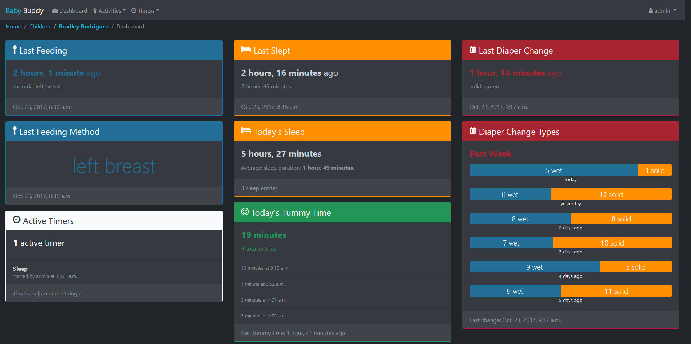

# Baby Buddy

A buddy for babies! Helps caregivers track sleep, feedings, diaper changes, 
tummy time and more to learn about and predict baby's needs without (*as much*)
guess work.

## Demo

A [demo of Baby Buddy](http://demo.baby-buddy.net) is available on Heroku.
The demo instance resets every hour. Login credentials are:

- Username: `admin`
- Password: `admin`

## Documentation

Visit [https://docs.baby-buddy.net](https://docs.baby-buddy.net) for full documentation.

### Additional documentation

- [Changelog](/CHANGELOG.md)
- [Security](/SECURITY.md)
- [License](/LICENSE) (BSD-2 Clause)

## Languages

Baby Buddy is available in a variety of languages thanks to the efforts of numerous
translators. Language can be set on a per-user basis from the user settings page
(`/user/settings/`). See [Contributing](https://docs.baby-buddy.net/contributing/translation/)
for information about how to create/update translations.

### Available languages

:es: Catalan

:cn: Chinese (simplified)

:netherlands: Dutch

:uk: English (U.K.)

:us: English (U.S.) *(base)*

:finland: Finnish

:fr: French

:de: German

:it: Italian

:poland: Polish

:portugal: :brazil: Portuguese

:mexico: :es: Spanish

:sweden: Swedish

:tr: Turkish

## Baby Buddy on the Web

This is a non-exhaustive list of neat projects and blog posts that either extend
or use Baby Buddy in fun ways. If you have a project to share please open a PR
adding it here or reach out via GitHub Issues or Discussions or on Gitter!

- [Home Assistant integration](https://github.com/jcgoette/baby_buddy_homeassistant)
- [Home Assistant Addon (host Baby Buddy on your Home Assistant)](https://github.com/OttPeterR/addon-babybuddy)
- [Baby Buddy and Home Assistant](https://martinnoah.com/babybuddy-and-home-assistant.html) (how-to guide)
- [Bottle Scale for BabyBuddy and Home Assistant with ESPHome](https://github.com/sfgabe/OITProjects/tree/master/BabyBuddy_ESP_HASS)
- [Alexa skill](https://github.com/babybuddy/babybuddy-alexa-skill)
- [Sandstorm app](https://github.com/babybuddy/babybuddy-sandstorm)
- [iOS shortcuts](https://github.com/babybuddy/babybuddy/discussions/300)
- Newborn parenting software - [part 1](https://lutzky.net/2021/10/03/software-parenting-1/), [part 2](https://lutzky.net/2021/10/05/software-parenting-2/), [part 3](https://lutzky.net/2021/10/10/software-parenting-3/) (API, buttons, LCD information screen!)
- [Quick Entry Keypad for BabyBuddy and Home Assistant with ESPHome](https://github.com/sfgabe/OITProjects/tree/master/Baby_Buddy_Keypad)

## Reporting Vulnerabilities

See [SECURITY.md](SECURITY.md) for information about where and how to report
potential Baby Buddy vulnerabilities.
