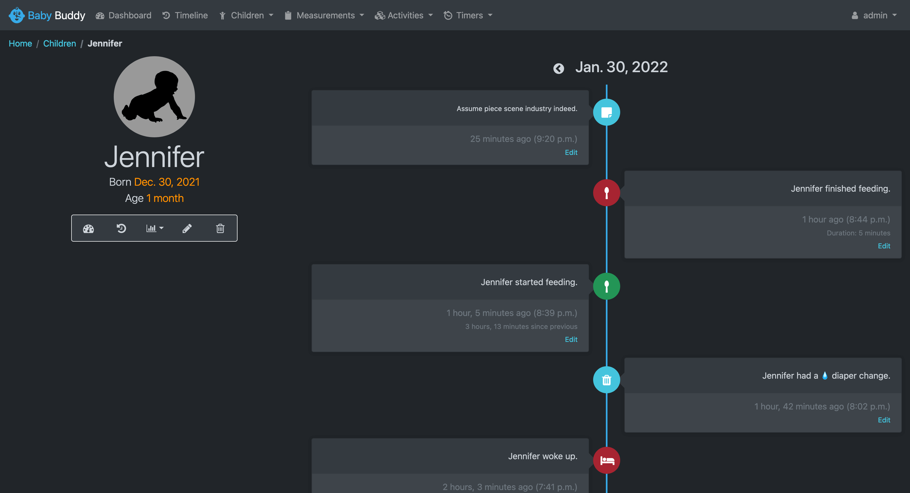

# Getting Started

## First Login

<video style="width: 100%;" autoplay controls loop muted playsinline>
  <source src="../../assets/videos/first_login.mp4" type="video/mp4">
</video>

## Dashboard

The Baby Buddy dashboard can be reached by selecting Dashboard on the menu or by
selecting the Baby Buddy icon in the upper left of the menu. The Dashboard lists
an overview of all elements related to your child, including:

- Last feeding is the time from the start of the last feed and how/where the milk came from (a bottle, or breast).
- Last diaper change is the time the last diaper change was logged and includes the type of diaper.
- Last sleep is the start of the last nap/sleep, and includes the nap duration below.
- Last feeding method is a quick view of how the baby was last fed. This is particularly useful for nursing mothers to remember which breast they started with on the previous feed.
- Today's Feeding is a snapshot of the total numbers of daily feeds.
- Timers let you know if you have a timer running.
- Statistics is a snapshot of various statistics – these can be scrolled through or select Statistics from the menu bar to see more.
- Today's Sleep lists the total number of hours slept for the day.
- Today's Naps lists the number of naps taken that day in bold and the total nap time below.
- Today's Tummy Time lists the total number of logged tummy time entries and then each individual entry below.
- Diaper Changes provides a view of the diapers logged over the week. Please note that.

Select the title of any of the cards to see more details.

## Timeline

The timeline page lists all your child's activities over time. On the left (or
top on mobile view) is an image of your baby, their name, date of birth, age and
then quick links to dashboard, timeline, reports, edit and delete.

The timeline lists all activities along with time frames, any notes and the
ability to edit any entry.

## Measurements

The Measurements menu provides the option to view and track your baby's
measurements of temperature, weight, height, head circumference and BMI.

Selecting any of the measurements will open that specific page with all related
measurements listed.

Add a specific measurement by selecting the add or + measurement.

## Activities

The Activities menu provides the option to view and track your baby's activities
such as diaper changes, feedings, sleep, and tummy time.

Selecting any of the activities will open that activities' page with all details
on recorded activities.

Add any activity via this menu as well. See [Adding Entries](adding-entries.md) for more
information.

## Timers

The Timers menu provides the option to start timers or view all current timers.

Quick Start Timer starts a brand-new timer. This is the preferred method to
starting timers.

Start Timer opens a new page to confirm the child the timer is for, name the
timer and update the start time before creating a timer.
